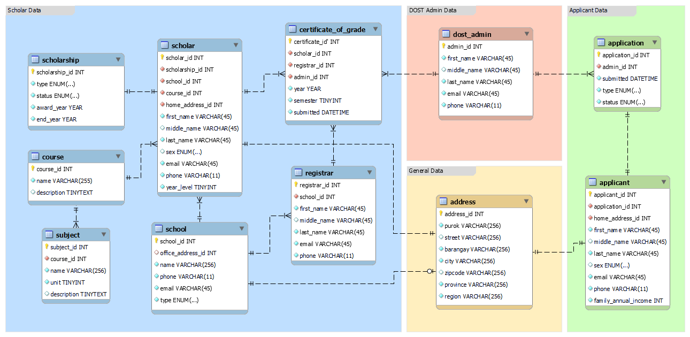

# DOST Scholarship Monitoring System Database


## Setup Guide

### How to make the database available in my machine?

1. Download the [MySQL Community Server](https://dev.mysql.com/downloads/mysql/). An installation guide is available [here](https://www.youtube.com/watch?v=u96rVINbAUI).
2. Open MySQL Workbench and connect to your default MySQL server from the home screen.
3. Open the project SQL script by clicking `File` > `Open SQL Script` in the top toolbar.
   - You may also use the keyboard shortcut `Ctrl`+`Shift`+`O`.
4. Navigate to the project folder and select `dost.sql`.
5. Execute the script by clicking `Query` > `Execute (All or Selection)` in the top toolbar.
   - You may also use the keyboard shortcut `Ctrl`+`Shift`+`Enter`.

### How to automatically populate records into the database?

1. [Python](https://www.python.org/downloads/) must be available on your computer.
2. Install [`mysql-connector-python`](https://pypi.org/project/mysql-connector-python/) as a Python package by running the command `pip install mysql-connector-python`.
3. Navigate to the project folder.
4. Run the automation script by executing the command `python main.py`.


## Sample views

### Female Bicolano scholars taking either BSIT or BSCS

```sql
CREATE VIEW BicolanoCSITScholars AS
SELECT scholar_id,
    CONCAT(last_name, ', ', first_name) AS full_name,
    sex,
    year_level
FROM scholar
    JOIN (address, course) ON (
        scholar.home_address_id = address.address_id
        AND scholar.course_id = course.course_id
    )
WHERE (
        address.region = 'Region V (Bicol Region)'
        AND (
            course.name = 'BS Information Technology'
            OR course.name = 'BS Computer Science'
        )
    );

```

| scholar_id | full_name                   | sex    | year_level |
|------------|-----------------------------|--------|------------|
| 1259       | "Makinano, Cecilia"         | FEMALE | 4          |
| 859        | "Calica, Luz"               | FEMALE | 1          |
| 955        | "Mabutas, Joan Perceval"    | FEMALE | 4          |


## CS105 Project Requirements

### Entity-relationship diagram




### Relational model


### Data dictionaries

#### Table: `applicant`

| Name                 | Data Type              | Not Null | PK  | FK  | Default |
| -------------------- | ---------------------- | -------- | --- | --- | ------- |
| applicant_id         | INT                    | Yes      | Yes | No  |         |
| application_id       | INT                    | Yes      | No  | Yes |         |
| home_address_id      | INT                    | Yes      | No  | Yes |         |
| first_name           | VARCHAR(45)            | Yes      | No  | No  |         |
| middle_name          | VARCHAR(45)            | No       | No  | No  | NULL    |
| last_name            | VARCHAR(45)            | Yes      | No  | No  |         |
| sex                  | ENUM('MALE', 'FEMALE') | No       | No  | No  | NULL    |
| email                | VARCHAR(45)            | Yes      | No  | No  |         |
| phone                | VARCHAR(11)            | Yes      | No  | No  |         |
| family_annual_income | INT                    | Yes      | No  | No  |         |

#### Table: `application`

| Name           | Data Type                             | Not Null | PK  | FK  | Default |
| -------------- | ------------------------------------- | -------- | --- | --- | ------- |
| application_id | INT                                   | Yes      | Yes | No  |
| admin_id       | INT                                   | Yes      | No  | Yes |
| submitted      | DATETIME                              | Yes      | No  | No  |
| type           | ENUM('RA2067', 'RA7687')              | Yes      | No  | No  |
| status         | ENUM('PENDING', 'APPROVED', 'DENIED') | Yes      | No  | No  |

#### Table: `registrar`

| Name         | Data Type   | Not Null | PK  | FK  | Default |
| ------------ | ----------- | -------- | --- | --- | ------- |
| registrar_id | INT         | Yes      | Yes | No  |
| school_id    | INT         | Yes      | No  | Yes |
| first_name   | VARCHAR(45) | Yes      | No  | No  |
| middle_name  | VARCHAR(45) | No       | No  | No  | NULL    |
| last_name    | VARCHAR(45) | Yes      | No  | No  |
| email        | VARCHAR(45) | Yes      | No  | No  |
| phone        | VARCHAR(11) | Yes      | No  | No  |

#### Table: `certificate_of_grade`

| Name            | Data Type | Not Null | PK  | FK  | Default |
| --------------- | --------- | -------- | --- | --- | ------- |
| certificate_id' | INT       | Yes      | Yes | No  |
| scholar_id      | INT       | Yes      | No  | Yes |
| registrar_id    | INT       | Yes      | No  | Yes |
| admin_id        | INT       | Yes      | No  | Yes |
| year            | YEAR      | Yes      | No  | No  |
| semester        | TINYINT   | Yes      | No  | No  |
| submitted       | DATETIME  | Yes      | No  | No  |

#### Table: `dost_admin`

| Name        | Data Type   | Not Null | PK  | FK  | Default |
| ----------- | ----------- | -------- | --- | --- | ------- |
| admin_id    | INT         | Yes      | Yes | No  |
| first_name  | VARCHAR(45) | Yes      | No  | No  |
| middle_name | VARCHAR(45) | No       | No  | No  | NULL    |
| last_name   | VARCHAR(45) | Yes      | No  | No  |
| email       | VARCHAR(45) | Yes      | No  | No  |
| phone       | VARCHAR(11) | Yes      | No  | No  |


#### Table: `scholarship`

| Name           | Data Type                                | Not Null | PK  | FK  | Default  |
| -------------- | ---------------------------------------- | -------- | --- | --- | -------- |
| scholarship_id | INT                                      | Yes      | Yes | No  |
| type           | ENUM('RA2067', 'RA7687')                 | Yes      | No  | No  |
| status         | ENUM('ACTIVE', 'ON_LEAVE', 'TERMINATED') | Yes      | No  | No  | 'ACTIVE' |
| award_year     | YEAR                                     | Yes      | No  | No  |
| end_year       | YEAR                                     | Yes      | No  | No  |

#### Table: `scholar`

| Name            | Data Type              | Not Null | PK  | FK  | Default |
|-----------------|------------------------|----------|-----|-----|---------|
| scholar_id      | INT                    | Yes      | Yes | No  |
| scholarship_id  | INT                    | Yes      | No  | Yes |
| school_id       | INT                    | Yes      | No  | Yes |
| course_id       | INT                    | Yes      | No  | Yes |
| home_address_id | INT                    | Yes      | No  | Yes |
| first_name      | VARCHAR(45)            | Yes      | No  | No  |
| middle_name     | VARCHAR(45)            | No       | No  | No  | NULL    |
| last_name       | VARCHAR(45)            | Yes      | No  | No  |
| sex             | ENUM('MALE', 'FEMALE') | No       | No  | No  | NULL    |
| email           | VARCHAR(45)            | Yes      | No  | No  |
| phone           | VARCHAR(11)            | Yes      | No  | No  |
| year_level      | TINYINT                | Yes      | No  | No  |

#### Table: `school`

| Name              | Data Type                 | Not Null | PK  | FK  | Default |
|-------------------|---------------------------|----------|-----|-----|---------|
| school_id         | INT                       | Yes      | Yes | No  |
| office_address_id | INT                       | No       | No  | Yes | NULL    |
| name              | VARCHAR(256)              | Yes      | No  | No  |
| phone             | VARCHAR(11)               | Yes      | No  | No  |
| email             | VARCHAR(45)               | Yes      | No  | No  |
| type              | ENUM('PUBLIC', 'PRIVATE') | Yes      | No  | No  |

#### Table: `course`

| Name        | Data Type    | Not Null | PK  | FK | Default |
|-------------|--------------|----------|-----|----|---------|
| course_id   | INT          | Yes      | Yes | No |
| name        | VARCHAR(255) | Yes      | No  | No |
| description | TINYTEXT     | No       | No  | No | NULL    |


#### Table: `subject`

| Name        | Data Type    | Not Null | PK  | FK  | Default |
|-------------|--------------|----------|-----|-----|---------|
| subject_id  | INT          | Yes      | Yes | No  |
| course_id   | INT          | Yes      | No  | Yes |
| name        | VARCHAR(256) | Yes      | No  | No  |
| unit        | TINYINT      | Yes      | No  | No  |
| description | TINYTEXT     | No       | No  | No  | NULL    |

#### Table: `address`

| Name       | Data Type    | Not Null | PK  | FK | Default |
|------------|--------------|----------|-----|----|---------|
| address_id | INT          | Yes      | Yes | No |
| purok      | VARCHAR(256) | Yes      | No  | No |
| street     | VARCHAR(256) | No       | No  | No | NULL    |
| barangay   | VARCHAR(256) | Yes      | No  | No |
| city       | VARCHAR(256) | Yes      | No  | No |
| zipcode    | VARCHAR(256) | No       | No  | No | NULL    |
| province   | VARCHAR(256) | Yes      | No  | No |
| region     | VARCHAR(256) | Yes      | No  | No |

### Normalization
aaa